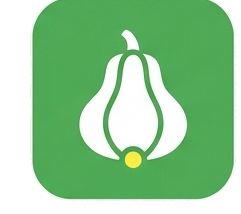
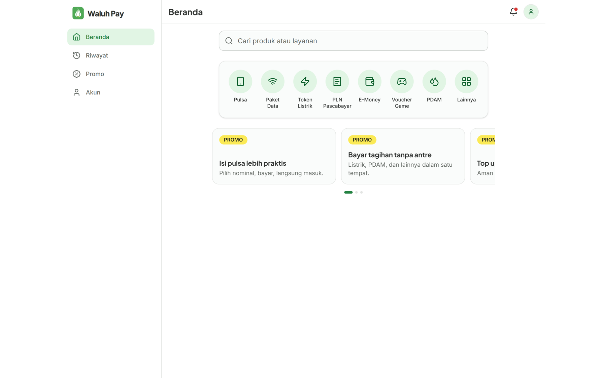
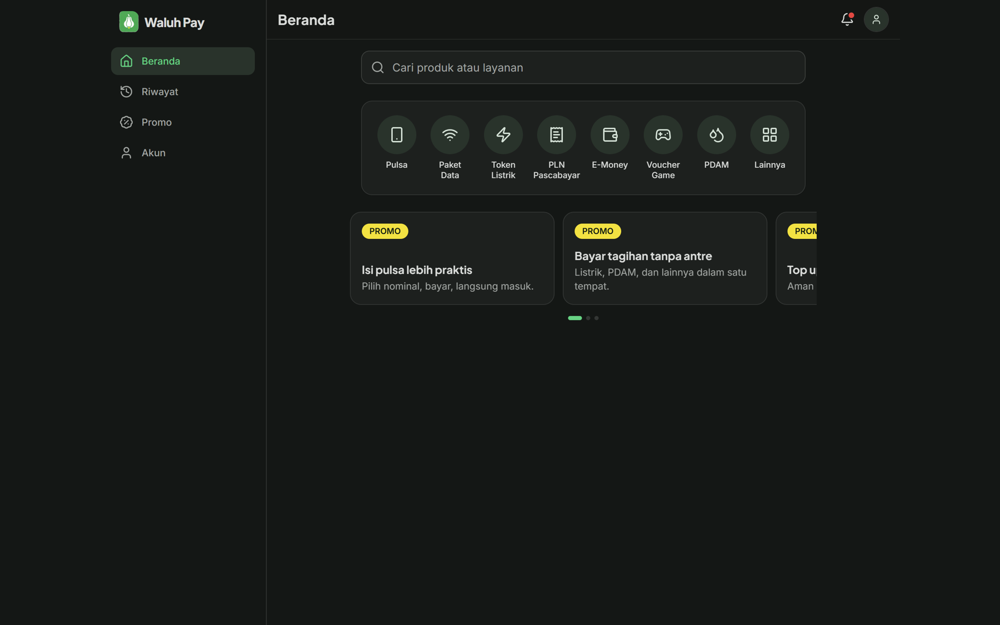
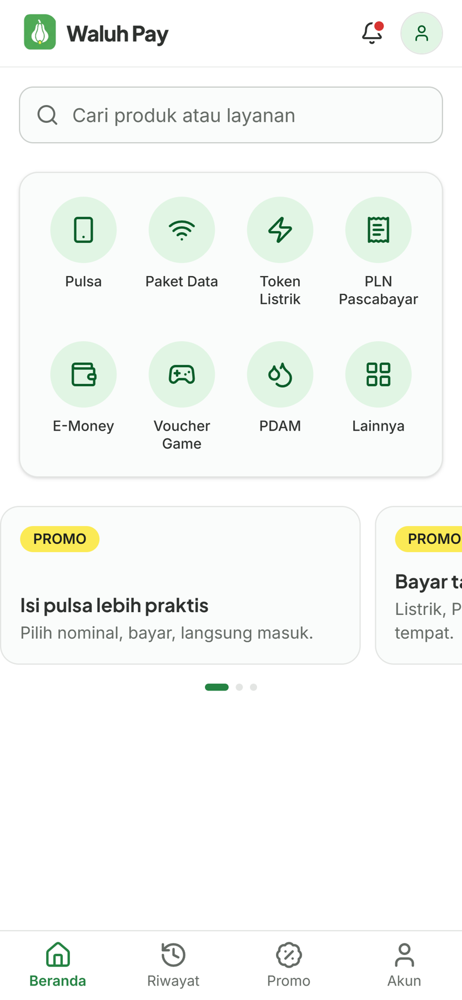
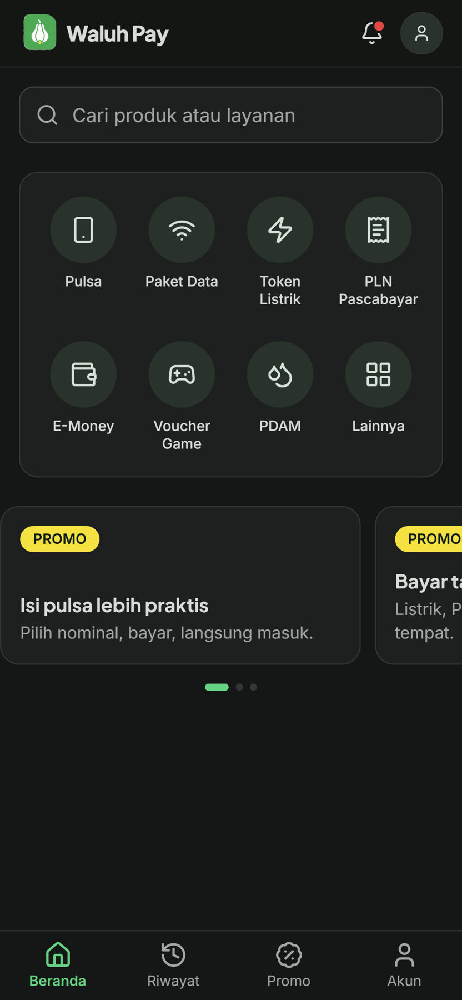

# Waluh Pay

### Beli produk digital dalam hitungan detik — tanpa perlu daftar.

Pulsa · Paket Data · Token Listrik · Tagihan · E-Money · Voucher Game · PDAM

 

---

## Apa itu Waluh Pay?

**Waluh Pay** adalah website jual-beli **produk digital (PPOB)** untuk konsumen umum — isi pulsa, beli paket data, token listrik PLN, bayar tagihan, top up e-money, sampai voucher game. Dirancang supaya **siapa pun bisa langsung membeli hanya dengan beberapa ketukan, tanpa harus membuat akun dulu.**

Cocok untuk pemilik usaha yang ingin punya toko produk digital sendiri: cepat dipakai pelanggan, mudah dikelola, dan tampil profesional di HP maupun desktop.

---

## Tampilan

### 💻 Desktop

| Mode Terang | Mode Gelap |
|:---:|:---:|
|  |  |

### 📱 Mobile

| Mode Terang | Mode Gelap |
|:---:|:---:|
|  |  |

---

## Kenapa Waluh Pay?

- ⚡ **Beli cepat tanpa login** — pelanggan langsung pilih produk, isi nomor, bayar. Tidak dipaksa mendaftar.
- 🎯 **Semua layanan di satu tempat** — pulsa, tagihan, token, e-money, voucher, dalam satu halaman yang rapi.
- 🛠️ **Katalog dikelola sendiri** — pemilik menambah/mengubah produk, harga, dan promo lewat panel admin, tanpa perlu programmer.
- 🔁 **Bebas pilih penyedia** — payment gateway dan pemasok produk bisa diganti/ditambah tanpa membongkar sistem.
- ✅ **Pembayaran terverifikasi otomatis** — status pesanan berpindah sendiri begitu pembayaran diterima.
- 🌗 **Nyaman siang & malam** — tampilan terang dan gelap, dioptimalkan untuk layar HP lebih dulu.

---

## Untuk Pelanggan

- Beranda dengan kategori berikon dan pencarian cepat.
- Alur beli singkat: pilih produk → isi nomor tujuan → bayar.
- **Guest checkout** — cukup email untuk terima struk & status.
- Halaman status pesanan yang transparan (menunggu bayar → dibayar → diproses → berhasil).
- Kode promo & diskon.
- Akun opsional untuk menyimpan riwayat dan nomor favorit.

## Untuk Pemilik Toko (Admin)

- Kelola kategori, produk, harga jual, dan margin.
- Pantau semua transaksi lengkap dengan status pembayaran & pengiriman.
- Buat dan atur kode promo (kuota, periode, batas per pengguna).
- Laporan omzet & laba, dengan ekspor.
- Atur payment gateway dan pemasok dari satu tempat.

---

## Produk yang Didukung

| | | |
|---|---|---|
| 📱 Pulsa | 🌐 Paket Data | ⚡ Token Listrik |
| 🧾 PLN Pascabayar | 👛 E-Money | 🎮 Voucher Game |
| 💧 PDAM | ➕ dan kategori lain | |

*Daftar kategori sepenuhnya dapat diatur oleh admin.*

---

## Dibangun di Atas Fondasi Modern

Bukan sekadar tampilan — Waluh Pay memakai teknologi yang stabil dan mudah dikembangkan:

- **Laravel 12** (backend andal, aman) + **React 19** via Inertia (antarmuka mulus seperti aplikasi).
- **Desain konsisten** dari satu sistem warna/brand (hijau labu khas Waluh Pay), terang & gelap.
- **Provider-agnostic** — payment gateway (mis. Tripay) dan pemasok (mis. Digiflazz) dibungkus lapisan yang bisa ditukar.
- Siap tumbuh: antrean/worker untuk transaksi, keamanan pembayaran (verifikasi callback, idempotensi).

---

## Status Pengembangan

Repositori ini transparan soal apa yang sudah jadi dan apa yang direncanakan:

**✅ Sudah ada**
- Fondasi aplikasi (Laravel + Inertia + React) & sistem desain brand (terang + gelap).
- Halaman **Beranda** siap pakai (seperti pada tangkapan layar di atas).

**🚧 Direncanakan** (sesuai peta jalan produk)
- Alur checkout & pembayaran (integrasi gateway).
- Panel admin (produk, transaksi, promo, laporan).
- Otomasi pemasok H2H & notifikasi.

---

## Dokumen Produk

Ingin melihat lebih dalam sebelum memutuskan? Tersedia dokumen lengkap:

- 📄 **[PRD](prd.md)** — kebutuhan & tujuan produk.
- 📐 **[SRS](srs.md)** — spesifikasi teknis terperinci.
- 🎨 **[Design System](design.md)** — panduan warna, tipografi, dan komponen.

---

**Waluh Pay** — produk digital, dibeli semudah mungkin. 🎃

Pemilik produk: Fikri Anshori · Pasar: Indonesia (IDR)

